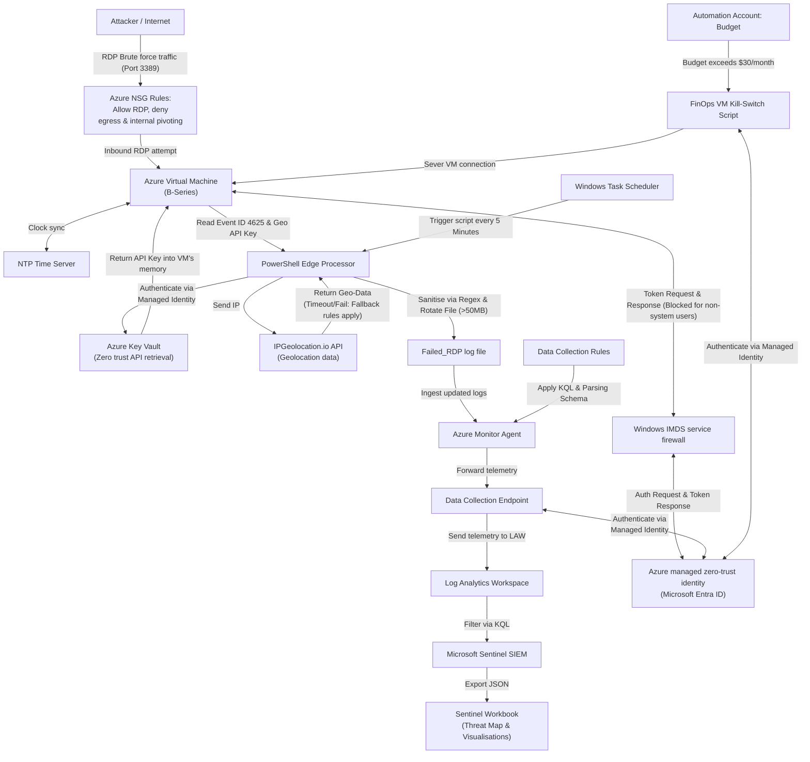

#     azure-zerotrust-secops-pipeline
An automated Azure SecOps pipeline engineered to process global MITRE T1110 threat telemetry. Features include strict network filtering, Zero-Trust managed identities, a custom C# .NET edge-processor, automated FinOps circuit breakers, KQL transformations, and live Microsoft Sentinel SIEM incident mapping. 

**Core Technologies:** Azure Sentinel (SIEM) | Log Analytics (LAW) | Kusto Query Language (KQL) | PowerShell | C# .NET | Microsoft Entra ID (Zero Trust) | FinOps Automation

---

**[View the Live Global Threat Map Here](https://kalen1c.github.io/azure-zerotrust-secops-pipeline/visualisations/live-threat-map.html)**

---
# Architecture & Threat Intelligence Brief: MITRE T1110 Analysis

## 1. Executive Summary

This project engineers a highly resilient, cost-optimised Azure SecOps data pipeline designed to capture and analyse live MITRE T1110 (Brute Force) campaigns. By utilising a custom PowerShell and C# .NET edge-processor, Zero-Trust managed identities, and automated FinOps circuit breakers, this architecture successfully handles high-velocity attacks while drastically lowering the Total Cost of Ownership (TCO) across compute, API integration, and cloud telemetry ingestion.

Bridging the gap between raw Windows event logs and actionable business risk, the pipeline extracts and enriches authentication failures at the edge into batched JSON telemetry. This data is securely routed through the Azure Monitor Agent (AMA) and parsed by Data Collection Rules (DCR) into discrete SIEM database columns. This equips security teams to visualise global adversary infrastructure in Microsoft Sentinel and deploy targeted perimeter defenses, all within a strictly isolated and financially capped environment.

---
## 2. Architecture & Resiliency Controls

To simulate a production environment while strictly containing the blast radius of the vulnerable node, the following security, cost, and reliability controls were engineered into the pipeline:

### Cost & FinOps Controls

* **Stateful Log Aggregation (Edge Processing):** To prevent cloud ingestion billing spikes during high-velocity attacks, the PowerShell pipeline acts as an edge processor. It utilises an in-memory hash table to batch IP addresses and count attempt frequencies, flushing deduplicated metrics to Azure at 5-minute intervals. This reduces cloud ingestion costs by >95% while maintaining volumetric fidelity.
* **FinOps Kill-Switch Automation:** As a fail-safe against volumetric DDoS campaigns generating massive log sets, an Azure Automation Account is linked to a strict $30/month budget trigger. If cloud ingestion spending exceeds this limit, a webhook automatically severs the VM's network connection to prevent financial overrun.
* **Burstable Compute (B-Series):** The honeypot runs on an affordable Azure B-Series VM. Because brute-force attacks occur in sudden spikes rather than constant streams, this setup banks CPU credits during idle periods to handle the heavy processing load when an attack hits.
* **Basic Logs Data Tiering:** Azure Log Analytics Workspace (LAW) charges premium rates for default analytics-tier ingestion. Because this project generates high-volume, low-complexity data, the destination tables are explicitly routed to Azure's "Basic Logs" tier. This drastically reduces ingestion costs while keeping the telemetry available for Sentinel dashboards.

### Security & Containment (SecOps)

* **Zero-Trust Secrets Management:** API authentication bypasses local disk storage entirely. Using a System-Assigned Managed Identity, the VM queries the Instance Metadata Service (IMDS) for an Entra ID token, dynamically retrieving the Geolocation API key from Azure Key Vault directly into volatile memory (RAM).
* **Defense-in-Depth (IMDS Firewall Block):** To prevent post-compromise credential harvesting, local Windows Defender Firewall rules block outbound access to the Azure IMDS endpoint (`169.254.169.254`) for all non-system users. This ensures that even if an attacker gains RDP access, they cannot extract the VM's managed identity tokens.
* **Egress Filtering & VNet Isolation:** A primary liability of an exposed honeypot is its potential use as a pivot point. The Virtual Network (VNet) enforces strict Network Security Group (NSG) rules, explicitly dropping all outbound traffic to internal RFC 1918 ranges and unapproved external endpoints.
* **Data Sanitisation (Anti-Log Poisoning):** To prevent SIEM database corruption and parsing errors, the PowerShell edge processor utilises Regex to strip special characters and KQL control operators from the Windows `TargetUserName` field before formatting the output, neutralising malicious ingress attempts.

### Reliability & Data Engineering (SRE)

* **C# .NET Stream Processing:** To solve native file-locking conflicts between the edge processor and the Azure Monitor Agent (which utilises Fluent-Bit), the script relies on custom C# .NET streams. This enables concurrent read/write access to the local JSONL log file, preventing telemetry drops during high-velocity attacks.
* **Graceful API Degradation:** The pipeline is engineered to survive third-party outages natively. If the external Geolocation API times out or throttles requests, the script applies fallback rules (e.g., a `Geo_Unavailable` placeholder) and continues processing so the SIEM never drops the underlying authentication alert.
* **Automated Log Rotation & Time Sync:** The script enforces a 50MB automated log rotation threshold on the local log file to prevent disk exhaustion. Furthermore, the VM enforces strict NTP synchronisation to prevent clock drift, ensuring absolute time-series integrity for Sentinel's velocity graphs.
* **Ingestion-Time Transformation:** To optimise database query performance and lower storage overhead, the Data Collection Rule (DCR) utilises a defined JSON schema to parse raw JSONL telemetry into discrete columns. KQL is applied strictly for lightweight ingestion-time transformations such as normalising custom timestamp fields prior to Log Analytics Workspace commit.

  
---
## 3. Architecture Topology & Data Flow

---
## 4. Repository Navigation
* **[`/visualisations/`](./visualisations/visualisations.md)** - Contains the interactive global threat map and high-resolution Microsoft Sentinel SIEM charts.
* **[`/infrastructure/`](./infrastructure/)** - Contains the complete PowerShell deployment script (including IMDS Zero-Trust firewall rules) and VNet NSG configurations.
* **[`/scripts/`](./scripts/)** - Contains the core PowerShell automation logic, including the custom C# .NET edge-processor, the 5-minute scheduling loop, and the FinOps kill-switch.
* **[`/kql/`](./kql/)** - Contains the ingestion-time DCR schema transformations and Microsoft Sentinel threat hunting queries.
* **[`/dashboards/`](./dashboards/)** - Contains the exported JSON template of the Sentinel Workbook.
* **[`/docs/`](./docs/)** - Contains the daily progress log and MITRE T1110 threat analysis notes.

---
**Disclaimer:** *This project was conducted in a strictly controlled, isolated cloud environment for educational and threat intelligence gathering purposes. The infrastructure was hardened to prevent lateral movement and explicitly denied outbound traffic to prevent its use as a pivot point. All captured data (such as attacker IPs) has been anonymised or hashed where appropriate to adhere to ethical sharing standards.*

---
**Project Methodology:** To push my cloud security skills beyond standard tutorials, I used AI to help establish the initial project parameters and map out the target architecture. Everything beyond that initial blueprint, the coding, cloud infrastructure configuration, troubleshooting, and learning is entirely my own hands-on work. The following commits document my journey of actively building this complex system from the ground up.

You can view my technical hurdles, bug fixes, planning and build progress in the
[**/docs/progress-log.md**](./docs/progress-log.md)
