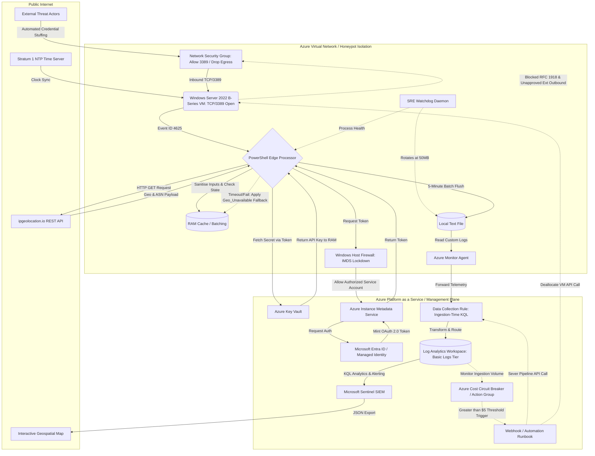

# sentinel-kql-threat-research
Azure SIEM architecture logging and analysing global MITRE T1110 threat telemetry. Built with a Microsoft Sentinel pipeline, custom PowerShell scripts querying REST APIs, modern DCR ingestion, KQL threat hunting, and GitHub Pages interactive incident mapping.

---
# Architecture & Threat Intelligence Brief: MITRE T1110 Analysis

## 1. Executive Summary
This project engineers a highly resilient, cost-optimised Azure honeypot designed to capture and analyse live MITRE T1110 (Brute Force) and T1110.003 (Password Spraying) campaigns. By utilising custom PowerShell edge-processing, Azure Data Collection Rules (DCR), and Microsoft Sentinel, this architecture reduces SIEM ingestion costs by >95%.

This architecture bridges the gap between raw Windows event logs and business risk by transforming high-volume authentication failures into structured metrics, equipping security teams to deploy targeted identity and perimeter defences based on real-time threat intelligence.

---
## 2. Architecture & Resiliency Controls
To simulate a production environment while strictly containing the blast radius of the vulnerable node, the following security and cost controls were engineered:

### Cost & FinOps Controls
* **Stateful Log Aggregation:** To prevent cloud ingestion billing spikes during high-velocity attacks, the PowerShell pipeline acts as an edge processor. It utilises an in-memory hash table to batch IP addresses and count attempt frequencies, flushing deduplicated metrics to Azure at 5-minute intervals. This reduces cloud ingestion costs by >95% while maintaining volumetric fidelity.
* **Automated Cost Circuit Breaker:** As a fail-safe against volumetric DDoS campaigns generating massive log sets, an Azure Action Group is configured. If ingestion spending exceeds a predefined micro-budget, a webhook automatically severs the DCR pipeline and deallocates the VM to prevent financial overrun. 
* **Burstable Compute Strategy (B-Series):** The honeypot runs on an affordable Azure B-Series VM. Since brute-force attacks happen in sudden spikes rather than constant streams, this setup saves money by banking CPU credits during quiet periods to handle the heavy processing load when an attack actually hits.
* **Basic Logs Data Tiering:** By default, Azure charges premium rates for log ingestion. Because this project generates massive amounts of high-volume, low-complexity data, the destination tables are explicitly routed to Azure's cheaper "Basic Logs" tier. This cuts ingestion costs significantly while keeping the data available for Sentinel dashboards.

### Security & Containment (SecOps)
* **Zero-Trust Secrets Management (PoLP):** API authentication bypasses local disk storage entirely. Operating under the Principle of Least Privilege (PoLP), the VM's System-Assigned Managed Identity is scoped exclusively to read a single Azure Key Vault secret. The script queries the Instance Metadata Service (IMDS) to fetch an OAuth 2.0 token, dynamically retrieving the API key directly into volatile memory (RAM).
* **Egress Filtering & VNet Isolation:** A primary liability of deploying an exposed honeypot is its potential use as a pivot point or DDoS relay post-compromise. To neutralise this, the Virtual Network (VNet) enforces strict Network Security Group (NSG) egress rules, explicitly dropping all outbound traffic to internal RFC 1918 IP ranges and unapproved external endpoints.
* **Input Sanitisation (Anti-Log Poisoning):** To prevent CSV injection and SIEM database corruption, the extraction pipeline strictly sanitises all captured data. Commas, special characters, and KQL operators are stripped from the Windows `TargetUserName` field before formatting, neutralising malicious ingress attempts.
* **Host-Level IMDS Lockdown:** The extraction script needs to talk to Azure's internal metadata service (IMDS) to retrieve its secure tokens. To prevent post-compromise credential harvesting, Windows firewall rules block all IMDS access except for the specific service account running the script.

### Reliability & Data Engineering (SRE)
* **Graceful API Degradation:** The pipeline is engineered to survive third-party outages natively. If the external Geolocation REST API times out or throttles requests, the script catches the exception, applies a `Geo_Unavailable` placeholder, and continues processing so the SIEM never drops critical authentication alerts.
* **Process Resiliency & Log Rotation (SRE Watchdog):** A secondary background daemon monitors the primary extraction script to ensure continuous telemetry generation. It initiates an automated restart if the primary process fails and enforces local log rotation (archiving the text file if it exceeds 50MB) to prevent local disk exhaustion. Furthermore, the edge node enforces strict NTP synchronisation to prevent clock drift, ensuring absolute time-series integrity for the SIEM's velocity graphs.
* **Ingestion-Time Data Transformation:** To optimise database query performance and lower storage overhead, raw comma-separated telemetry is parsed into discrete schema columns using Kusto Query Language (KQL) directly at the DCR layer, prior to Log Analytics Workspace commit.

---
## 3. Architecture Topology & Data Flow

---
## 4. Repository Navigation (COMING SOON)
* `/planning/`
* `/visualisations/`
* `/incident-response/`
* `/infrastructure/`
* `/scripts/`
* `/dashboards/`

---
**Disclaimer:** *This project was conducted in a strictly controlled, isolated cloud environment for educational and threat intelligence gathering purposes. The infrastructure was hardened to prevent lateral movement and explicitly denied outbound traffic to prevent its use as a pivot point. All captured data (such as attacker IPs) has been anonymized or hashed where appropriate to adhere to ethical sharing standards.*

---
Project Methodology: To push my cloud security skills beyond standard tutorials, I used AI to help establish the initial project parameters and map out the target architecture. Everything beyond that initial blueprint, the coding, cloud infrastructure configuration, troubleshooting, and learning is entirely my own hands-on work. The following commits document my journey of actively building this complex system from the ground up.

You can view my technical hurdles, bug fixes, planning and build progress in the
`/Troubleshooting & Progress Log/`
